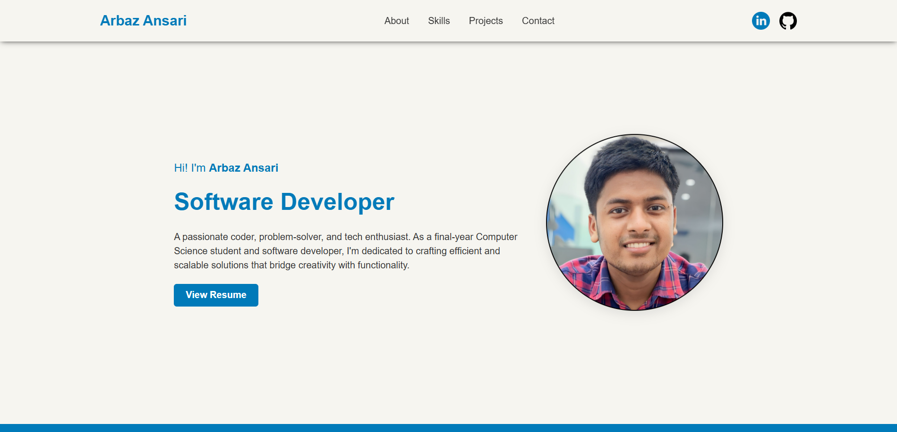
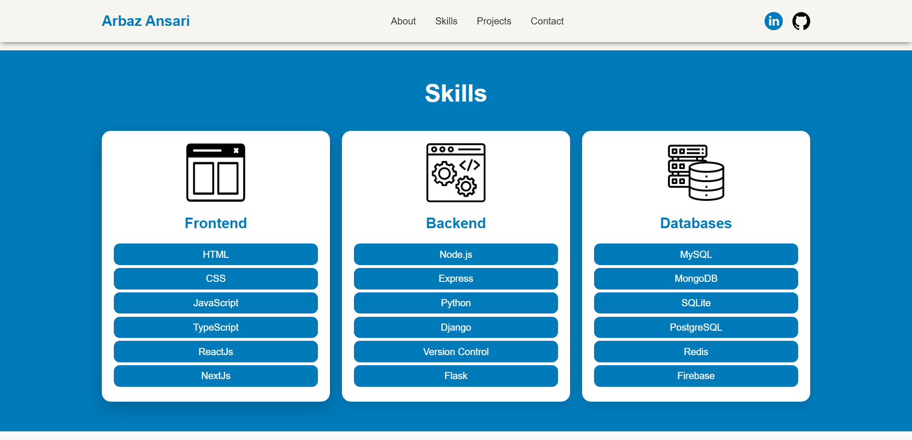
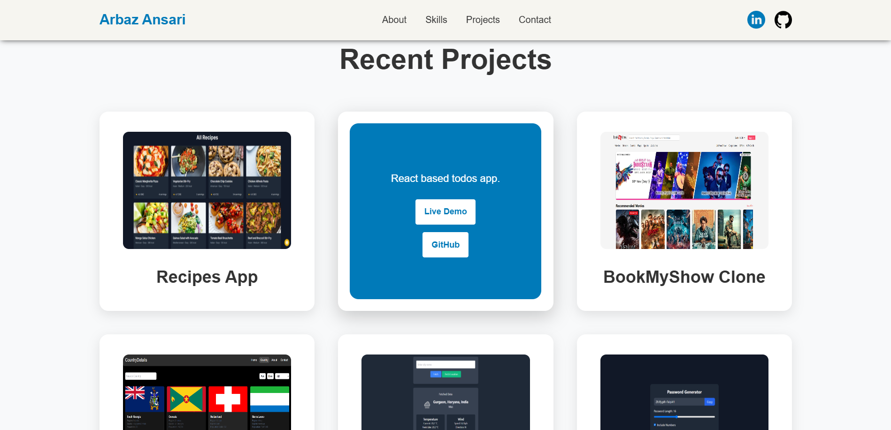
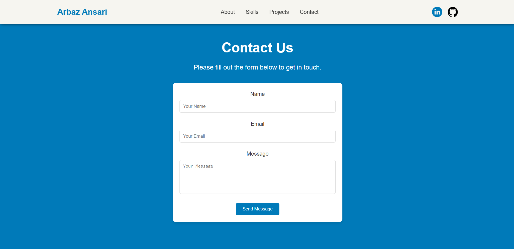
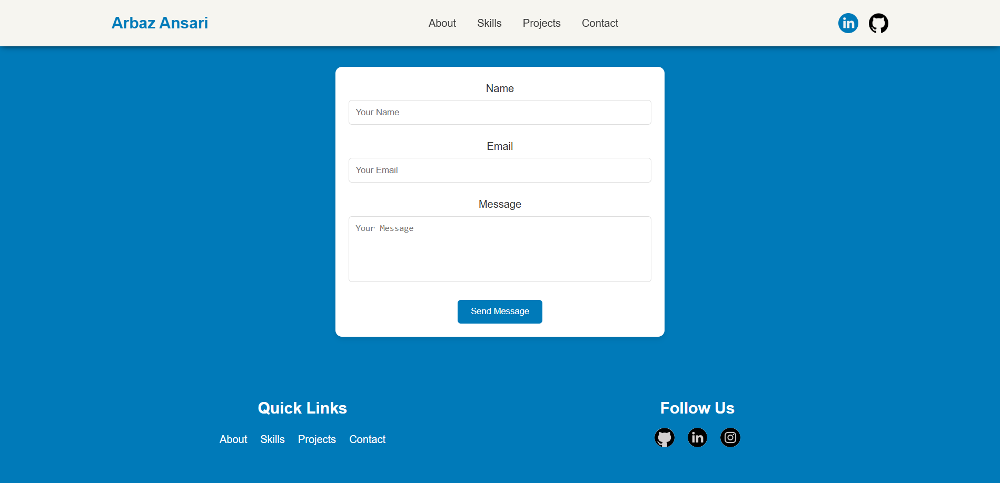

# My Portfolio

Welcome to my personal portfolio website! This project showcases my skills, projects, and contact information.

# Live Demo: [My Portfolio](https://arbazansari-hackathon.netlify.app/)

## Introduction

This is my personal portfolio website where I showcase my skills, projects, and provide a way for people to contact me. The website is fully responsive and includes animations to enhance the user experience.

## Screenshot

<p align="center">
  
  
  
  
  
</p>

## Features

-   Responsive design
-   Animated hero section
-   Skills section with cards
-   Projects section with flip animations
-   Contact form
-   Footer with social media links

## Technologies Used

-   HTML
-   CSS

## Setup

To run this project locally, follow these steps:

1. Clone the repository:
    ```bash
    git clone https://github.com/YourUsername/your-portfolio.git
    ```
2. Navigate to the project directory:
    ```bash
    cd your-portfolio
    ```
3. Open `index.html` in your preferred web browser.
